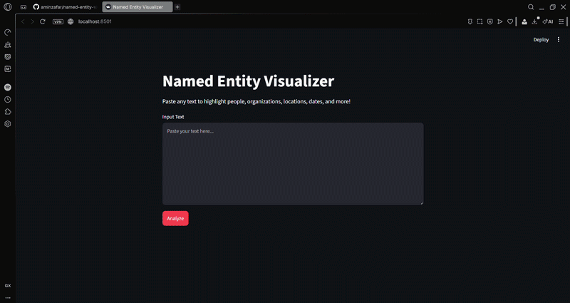

# Named Entity Visualizer

A text analysis app powered by [spaCy](https://spacy.io/) and its built-in visualization tool displacy.
Paste any article or block of text and watch people, organizations, locations, dates, and more highlight in color instantly.
Runs entirely on your machine, no API key or cost.

---

## Demo



---

## Features

- Color-coded highlighting for named entities directly inside the text
- Recognizes people, organizations, locations, dates, monetary values, and more
- Entity summary grouped by type below the visualization
- Runs 100% locally

---

## Setup

**1. Clone the repo**

```bash
git clone https://github.com/aminzafar/named-entity-visualizer.git
cd named-entity-visualizer
```

**2. Create and activate a virtual environment**

```bash
python -m venv .venv

# Windows
.venv\Scripts\activate

# macOS / Linux
source .venv/bin/activate
```

**3. Install dependencies**

```bash
pip install -r requirements.txt
```

**4. Download the spaCy language model**

```bash
python -m spacy download en_core_web_sm
```

**5. Run the app**

```bash
streamlit run app.py
# Opens automatically at http://localhost:8501
```

---

## Tech Stack

| Tool | Purpose |
|------|---------|
| [spaCy](https://spacy.io/) | NLP and entity recognition pipeline |
| [displacy](https://spacy.io/usage/visualizers) | Built-in entity visualization |
| [Streamlit](https://streamlit.io/) | Web UI framework |
| Python 3.11 | Core language |

---

Built by [Amin Zafar](https://github.com/aminzafar)